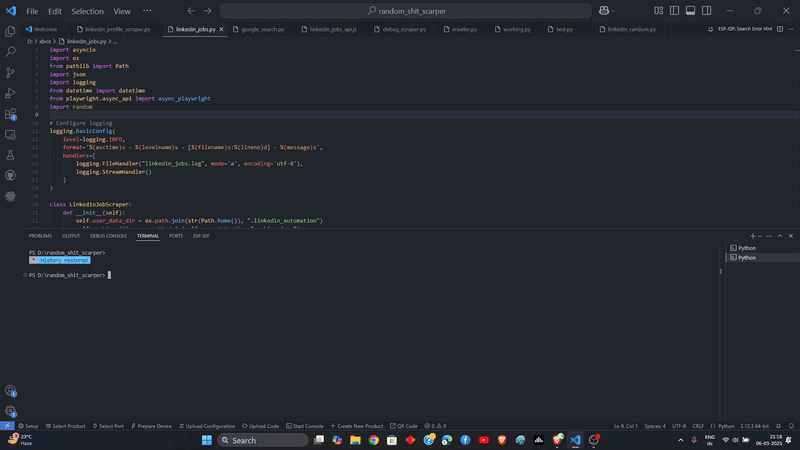

# LinkedIn Job Scraper

An asynchronous LinkedIn job scraping tool built with Python and Playwright that automates job listing extraction while handling authentication and session management.

## Features

- 🔐 **Smart Authentication**
  - Cookie-based session persistence
  - Automatic login handling when cookies expire
  - Secure credential management

- 🔄 **Dynamic Content Handling** 
  - Automated page scrolling
  - Concurrent batch processing
  - Waits for dynamic content loading

- 📊 **Comprehensive Data Extraction**
  - Job titles and links
  - Company information and logos
  - Location data
  - Application insights
  - Easy Apply status
  - Job posting metadata

- 🛠 **Robust Architecture**
  - Detailed logging system
  - Error handling and recovery
  - Configurable batch processing
  - Clean async/await implementation
# Demo


## Installation

```bash
# Clone the repository
git clone https://github.com/yourusername/linkedin-job-scraper.git
cd linkedin-job-scraper

# Install dependencies
pip install -r requirements.txt

# Install Playwright browsers
playwright install
```

## Usage

```python
from linkedin_jobs import LinkedInJobScraper
import asyncio

async def main():
    job_url = "your-linkedin-job-search-url"
    scraper = LinkedInJobScraper()
    await scraper.scrape_jobs(job_url)

if __name__ == "__main__":
    asyncio.run(main())
```

## Configuration

Add your LinkedIn credentials in the script or use environment variables:

```python
# Using environment variables (recommended)
import os

EMAIL = os.getenv('LINKEDIN_EMAIL')
PASSWORD = os.getenv('LINKEDIN_PASSWORD')
```

## Output Sample

```
Job 1:
============================================================
Title: Software Engineer
Company: Example Corp
Location: San Francisco, CA
Insight: Actively hiring
Status: Posted 2 days ago
Application: Easy Apply
Job Link: https://linkedin.com/jobs/view/...
Company Logo: https://media.linkedin.com/...
============================================================
```

## Future Improvements

1. **Data Storage**
   - Database integration
   - Export to various formats (CSV, JSON)
   - Historical data tracking

2. **Enhanced Features**
   - Salary information extraction
   - Company details scraping
   - Job description analysis
   - Keyword filtering

3. **Automation**
   - Scheduled scraping
   - Email notifications
   - Application automation

4. **UI/UX**
   - Web interface
   - Real-time monitoring
   - Custom search filters

## Contributing

1. Fork the repository
2. Create your feature branch (`git checkout -b feature/amazing-feature`)
3. Commit your changes (`git commit -m 'Add amazing feature'`)
4. Push to the branch (`git push origin feature/amazing-feature`)
5. Open a Pull Request

## License

This project is licensed under the MIT License - see the [LICENSE](LICENSE) file for details.

## Disclaimer

This tool is for educational purposes only. Make sure to comply with LinkedIn's terms of service and robot.txt policies when using this scraper.
